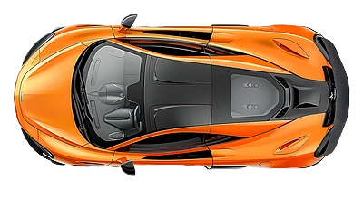

# AI Racing Car (Deep Q-Network)

A 2D racing game written in pygame, and a Deep Q-Network agent in PyTorch that learns to drive it.



## How it works

- **The game.** A hand-built track with 27 checkpoints and rectangular-hitbox collision detection. You can drive it yourself with the arrow keys.
- **What the agent sees.** Ten numbers: its speed, its heading, and the distance to the nearest wall along eight rays spaced 45° apart.
- **What it can do.** Three actions: accelerate, turn left, turn right.
- **How it learns.** A Deep Q-Network with three hidden layers of 128 units, trained with experience replay (a buffer of 10,000 transitions, batches of 64), a separate target network, a discount factor of 0.99, and epsilon-greedy exploration that decays from 1.0 to 0.05.
- **Rewards.** +300 for each checkpoint, small rewards for keeping up speed and staying clear of walls, -50 for a crash, and a small penalty per time step so that it does not dawdle.

## Running it

```bash
pip install -r requirements.txt

python Car_driving.py        # drive the car yourself
python ai_training.py        # train the agent
python ai_training.py test   # watch the trained agent (after training has saved a model)
python train_ai_simple.py    # menu-driven training
```

Training saves its progress to `car_racing_ai_model.pth`, so you can stop and resume. Delete that file to start again from scratch. Turning rendering off makes training much faster.

### Controls when driving manually

| Key | Action |
|---|---|
| Up arrow | Accelerate |
| Left / Right arrow | Turn (only while moving) |
| R | Reset the car |
| T | Toggle collision detection |
| Esc | Quit |

## Files

| File | What it is |
|---|---|
| `Car_driving.py` | The game: car physics, track, checkpoints, ray casting |
| `ai_training.py` | The DQN, replay buffer, training loop and test mode |
| `train_ai_simple.py` | A small menu for starting training runs |

## Built with

Python, PyTorch, pygame, NumPy, matplotlib.
